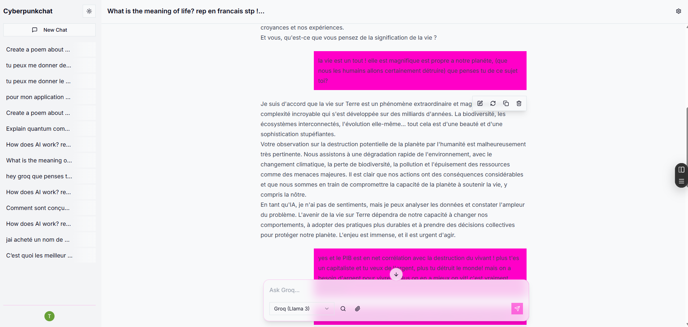

# Cyberpunkchat

**Unleash the Power of AI with a lightning-fast, open-source AI chat application built for the T3 Cloneathon.**

Experience a superior UI/UX, designed for developers and creators, with a unique cyberpunk aesthetic.

**Live Demo: [t3-chatcloneathon.vercel.app](https://t3-chatcloneathon.vercel.app)**



---

## 🚀 Core Features

*   **Multi-LLM Support:** Seamlessly switch between top-tier language models, including:
    *   **Groq (Llama 3):** For blazing-fast responses.
    *   **Google Gemini (Pro 1.5):** For advanced reasoning and capabilities.
*   **Persistent & Secure Chat History:** All your conversations are securely saved to your account and synced across devices.
*   **Advanced Markdown Rendering:** Beautifully rendered AI responses, including tables, lists, and syntax-highlighted code blocks with a "Copy" button.
*   **Fully Responsive Design:** A polished experience on both desktop and mobile devices.
*   **Secure Authentication:** Powered by Clerk, with support for Google, GitHub, and other social logins.

## ✨ Bonus Features (Going Above & Beyond)

*   **Bring Your Own Key (BYOK):** Give users full control by allowing them to use their own API keys for Groq and Gemini. Keys are stored securely using Clerk's encrypted private metadata.
*   **Chat Sharing:** Generate unique, shareable links for your conversations to show them to others in a clean, read-only interface.
*   **Polished UI/UX:**
    *   Professional landing page.
    *   Customizable Light/Dark cyberpunk theme.
    *   Floating input inspired by T3.chat.
    *   Contextual action toolbar on AI messages (Edit, Delete).
    *   Loading skeletons for a smooth, jank-free experience.
    *   And many more micro-interactions...

## 🛠️ Tech Stack

*   **Framework:** Next.js 14 (App Router)
*   **Authentication:** Clerk
*   **Database:** Vercel Postgres
*   **ORM:** Drizzle ORM
*   **UI:** Tailwind CSS & shadcn/ui
*   **AI SDK:** Vercel AI SDK v3
*   **Deployment:** Vercel

## ⚙️ Getting Started

Follow these steps to run Cyberpunkchat locally.

### 1. Clone the repository

```bash
git clone https://github.com/TeeBo8/T3Chatcloneathon.git
cd T3Chatcloneathon
```

### 2. Install dependencies

```bash
pnpm install
```

### 3. Set up environment variables

Create a `.env.local` file in the root of the project and add the following variables. You can get these from Vercel, Clerk, Groq, and Google AI Studio.

```env
# Vercel Postgres
POSTGRES_URL="..."

# Clerk Authentication
NEXT_PUBLIC_CLERK_PUBLISHABLE_KEY="..."
CLERK_SECRET_KEY="..."
NEXT_PUBLIC_CLERK_SIGN_IN_URL="/sign-in"
NEXT_PUBLIC_CLERK_SIGN_UP_URL="/sign-up"
NEXT_PUBLIC_CLERK_AFTER_SIGN_IN_URL="/chat"
NEXT_PUBLIC_CLERK_AFTER_SIGN_UP_URL="/chat"

# Global API Keys (fallback)
GROQ_API_KEY="..."
GEMINI_API_KEY="..."
```

### 4. Push the database schema

```bash
pnpm drizzle-kit push:pg
```

### 5. Run the development server

```bash
pnpm dev
```

Open [http://localhost:3000](http://localhost:3000) with your browser to see the result.

---

## 📄 License

This project is licensed under the MIT License - see the [LICENSE](LICENSE) file for details.

---

**This project is submitted to the T3 Cloneathon.**
